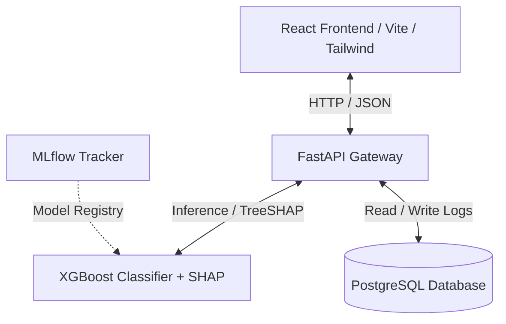

# 🛡️ FraudShield AI — Real-time End-to-End Fraud Detection System

FraudShield AI is an industry-level, production-ready transaction monitoring system. It leverages machine learning classifiers, Explainable AI (SHAP), a high-performance FastAPI backend, a responsive React dashboard, and a Dockerized PostgreSQL setup to identify, log, and analyze fraudulent activities.

---

## 🏗️ System Architecture



1. **Frontend**: React (Vite, Tailwind CSS, Recharts) provides an interactive UI, showcasing security KPIs, charts, CSV batch uploads, paginated transaction histories, and SHAP visual explanations.
2. **Backend**: FastAPI exposes REST endpoints for prediction, CSV parsing, history paging, and SHAP explainability.
3. **Machine Learning**: Pre-trained XGBoost classifier and StandardScaler load dynamically to perform sub-millisecond inference and explain predictions.
4. **Database**: PostgreSQL logs transactions (`PredictionLog`) including amounts, classifications, timestamps, and probabilities.

---

## 🛠️ Technology Stack

- **Frontend**: React 19, Vite, Recharts, Tailwind CSS v4, Axios, React Icons.
- **Backend**: Python 3.12, FastAPI, SQLAlchemy ORM, Uvicorn, Pandas, Numpy.
- **Machine Learning / Explainable AI**: XGBoost, Scikit-learn, SHAP (TreeExplainer), Joblib.
- **Database**: PostgreSQL 17.
- **MLOps / Infrastructure**: Docker, Docker Compose, MLflow.

---

## 🚀 Quick Start (Dockerized)

Ensure you have Docker and Docker Compose installed.

### 1. Build and Run the Stack
Run the following command in the root folder:
```bash
docker-compose up --build
```
This spins up:
- **Database**: PostgreSQL on port `5432` (with database health checks).
- **Backend API**: FastAPI on port `8000`.
- **Frontend App**: React served via Nginx on port `5173`.

### 2. Verify Services
- **Frontend Portal**: Navigate to [http://localhost:5173](http://localhost:5173) in your browser.
- **API Swagger Docs**: Visit [http://localhost:8000/docs](http://localhost:8000/docs).

---

## 💻 Local Development Setup

If you prefer to run services outside of Docker:

### Prerequisites
- Python 3.11+
- Node.js 20+
- PostgreSQL database running locally

### 1. Backend Setup
1. Navigate to the backend directory:
   ```bash
   cd backend
   ```
2. Create and activate a virtual environment:
   ```bash
   python -m venv venv
   source venv/bin/activate  # On Windows: venv\Scripts\activate
   ```
3. Install dependencies:
   ```bash
   pip install -r requirements.txt
   pip install httpx  # For testing client
   ```
4. Create a `.env` file containing your local credentials:
   ```env
   DB_HOST=localhost
   DB_PORT=5432
   DB_NAME=fraudshield_db
   DB_USER=postgres
   DB_PASSWORD=yourpassword
   ```
5. Start the server:
   ```bash
   uvicorn main:app --reload
   ```

### 2. Frontend Setup
1. Navigate to the frontend directory:
   ```bash
   cd frontend
   ```
2. Install npm modules:
   ```bash
   npm install
   ```
3. Run the development server:
   ```bash
   npm run dev
   ```
4. Access the web app at the displayed URL (typically `http://localhost:5173`).

---

## 🧪 Running API Unit Tests

FastAPI unit tests are configured using `pytest` and Starlette's `TestClient`.

From the `backend` directory, run:
```bash
python -m pytest -v tests/test_api.py
```

---

## 📡 API Reference

### Real-Time Monitoring
* **`POST /predict`**: Accepts a single transaction payload. Returns a binary classification (`0` or `1`) and risk probability.
* **`POST /explain`**: Returns the top 5 most impactful features and their absolute SHAP values.
* **`POST /upload-csv`**: Accepts a transaction CSV file, performs batch inference, and bulk inserts logs.

### Dashboards & Analytics
* **`GET /dashboard`**: Returns summary KPIs.
* **`GET /analytics`**: Returns database analytics metrics.
* **`GET /fraud-distribution`**: Returns counts of legitimate vs fraudulent items.
* **`GET /recent-transactions`**: Returns the last N logged predictions.
* **`GET /daily-trend`**: Returns transaction volumes grouped by date.
* **`GET /history`**: Paginated, sortable, and filterable log query system.

---

## 🔒 Security & Environment Variables

Make sure the following variables are configured before deployment:

| Variable | Description | Default |
|---|---|---|
| `DB_HOST` | Hostname of the PostgreSQL server | `localhost` |
| `DB_PORT` | Port of the database | `5432` |
| `DB_NAME` | Name of the database schema | `fraudshield_db` |
| `DB_USER` | Admin username | `postgres` |
| `DB_PASSWORD`| Admin password | `your password` |
| `VITE_API_URL` | Frontend pointer to Uvicorn API | `http://localhost:8000` |
